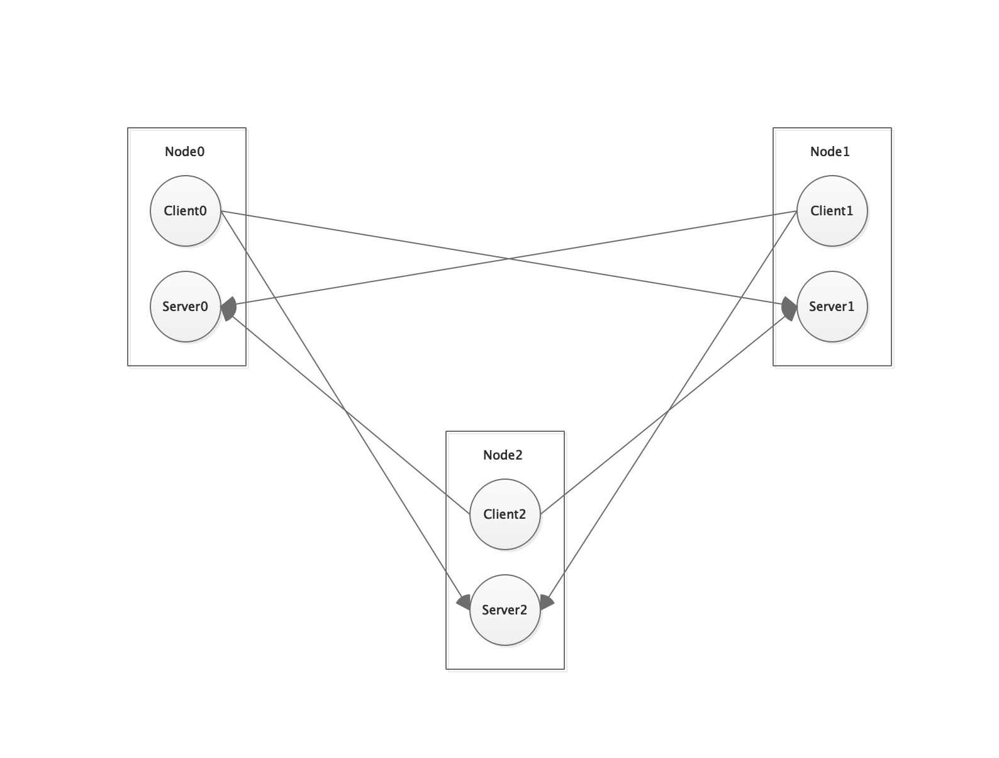

# 信息交换底层协议

[](https://www.apache.org/licenses/LICENSE-2.0.html)

### 角色
 + 本地节点
 + 远端节点

角色不区客户端和服务端，只区分本地节点和远端节点，每个节点都即是客户端又同时是服务端。

### 基本架构
 + 1、使用Netty开发，采用TCP的长连接形式；
 + 2、支持异常自动发现和重连；
 + 3、支持Client及Server多种处理机制；
 

每个节点内部采用单向通信方式，换句话说有一个对应的客户端和服务端，用于实现互相的信息交换，如下：




上图中存在应答，这种应答心跳的处理，不存在业务处理逻辑。


### 基本使用

```java
// 本地节点的地址（必须可被远端节点访问到）
String ADDRESS = "192.168.1.100";
// 本地节点监听端口
int CLIENT_PORT = 10002;
// 创建RemoteSessionManager
// MyMessageExecutor为自定义MessageExecutor的实现类
RemoteSessionManager sessionManager = new RemoteSessionManager(new LocalNode(ADDRESS, CLIENT_PORT, new MyMessageExecutor()));

// 创建一个远端节点
int SERVER_PORT = 10003;
RemoteNode remoteNode = new RemoteNode(ADDRESS, SERVER_PORT);
// 创建RemoteSession，前提：远端节点对应的RemoteSessionManager必须创建
RemoteSession remoteSession = client.newSession(remoteNode);
remoteSession.init();

// 发送请求
byte[] response = remoteSession.request(() -> "I am client".getBytes());
```

其他可参考：test.com.farmer.x.NodeTest_
